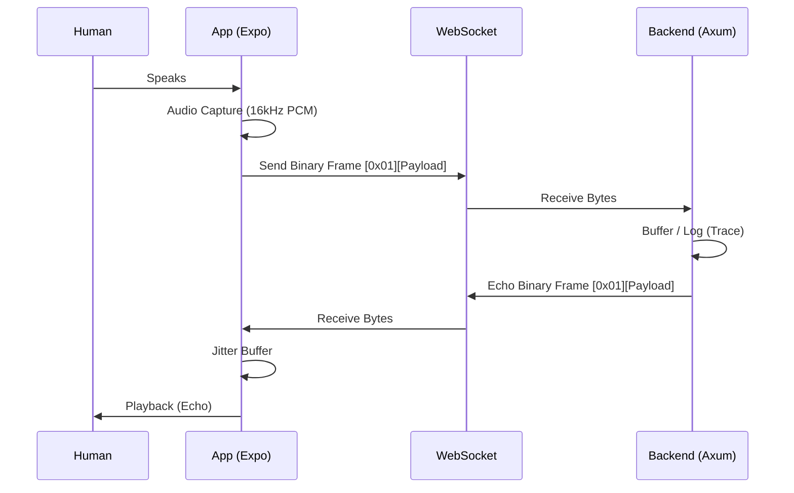

# Phase 1 Design: The "Live Wire" Foundation

**Target:** Establish a rock-solid, low-latency (<200ms roundtrip) bi-directional audio loop between React Native (Expo) and a Rust backend.

## 1. System Architecture

## 2. Protocol Specification (Binary)

We will use a custom binary protocol over WebSocket to minimize overhead. JSON is too slow for 50Hz audio packets.

### Packet Structure
Each frame sent over the WebSocket will follow this layout:

`| OpCode (1 byte) | Payload (N bytes) |`

**OpCodes:**
- `0x01` **Audio Frame:** Raw PCM data (16-bit, 16kHz, Mono).
- `0x02` **Config Frame:** JSON string describing session settings (not used for high-frequency data).
- `0x03` **Ping/Pong:** Latency heartbeat (Optional if WS level ping works well).

**Example Audio Frame:**
`[01] [DE AD BE EF ...]` -> 1 byte header, remainder is PCM.

## 3. Backend Design (Rust/Axum)

**Stack:** `axum` (Web), `tokio` (Runtime), `tracing` (Logs).

### Component: The Connection Handler
Each WebSocket connection spawns a lightweight Tokio task.

**Logic Flow:**
1.  **Upgrade:** `ws.on_upgrade(handle_socket)`
2.  **Split:** `let (mut sender, mut receiver) = socket.split();`
3.  **Loop:**
    - Match incoming message type.
    - If `Binary`:
        - Read 1st byte (OpCode).
        - If `0x01`: Echo payload back to `sender` immediately.
    - If `Close`: Break loop.

### Concurrency Model
-   **No Global State (Phase 1):** Phase 1 is stateless. Each connection is isolated.
-   **Trace Logging:** Use `tracing` to log packet arrival times for latency stats (e.g., `DEBUG received 4096 bytes`).

## 4. Frontend Design (Expo/React Native)

**Stack:** `expo-audio-stream` (Capture), `react-native-websocket` or native `WebSocket` API.

### Audio Configuration
-   **Sample Rate:** 16,000 Hz (Standard for Whisper/Deepgram/Gemini).
-   **Channels:** Mono (1 channel).
-   **Encoding:** PCM 16-bit (Little Endian).
-   **Chunk Size:** Aim for 100ms chunks (~3200 bytes) to balance latency vs. overhead.

### State Machine (UI)
The App has 3 primary states:
1.  **Idle:** "Connect & Start" button visible.
2.  **Connecting:** Initializing WS socket. Spinner.
3.  **Connected (Echo Loop):**
    -   *Mic:* Active.
    -   *Speaker:* Active (playing back echo).
    -   *UI:* "Stop" button + Live Latency Metric (ms).

### Buffer Strategy (The "Jitter Buffer")
Since generic WebSockets don't guarantee timing:
1.  **Capture Side:** Send chunks immediately as they arrive from the OS.
2.  **Playback Side:** Maintain a small circular buffer (e.g., 200ms) to prevent audio glitches (POPs/CLICKs) if a packet arrives late.

## 5. Verification & Success Criteria

### Functional Tests
-   [ ] **Connectivity:** App connects to `ws://localhost:3000/ws`.
-   [ ] **Echo:** Speak into phone -> Hear voice back (delayed).
-   [ ] **Silence:** No static/white noise when silent.

### Performance Tests
-   **Latency Check:** Clap hands. Measure time between real sound and phone echo. Goal: < 200ms.
-   **Stability:** Run for 5 minutes. Ensure no crashes or "drift" (echo getting later and later).
