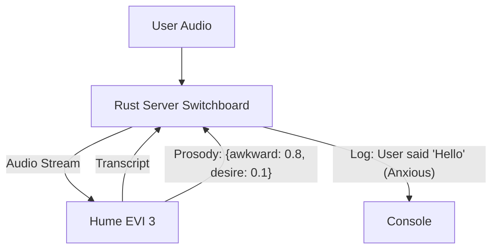

# Phase 2: The Ear (Hume AI Integration)

**Goal:** Establish the "Sensing Layer" by integrating Hume EVI 3. We focus solely on ingesting audio, transcribing it, and extracting prosody metrics (awkwardness, desire, anxiety).

## 1. The Sensor Architecture

In this phase, we only build **Branch 1** of the Tri-Force.

## 2. API Integration Strategy

### A. Hume EVI 3 (The "Ear")
*   **Role:** Raw Input Processor.
*   **Input:** User Audio (Binary Stream via WebSocket).
*   **Output:**
    *   **Transcript:** Real-time STT.
    *   **Prosody:** Scores for `awkwardness`, `desire`, `anxiety`, `excitement`.
*   **Protocol:** WebSocket (`wss://api.hume.ai/v0/evi/chat`).

## 3. Implementation Priorities

1.  **Step 1: The Client (HumeClient):**
    *   Implement `HumeClient` struct.
    *   Handle WebSocket Handshake with API Key.
    *   Impl `Stream` trait to send audio chunks.

2.  **Step 2: The Parser (HumeParser):**
    *   Deserialize JSON events (`UserMessage`).
    *   Extract `transcript.found` string.
    *   Extract `prosody.scores` map.

3.  **Step 3: The Verification:**
    *   Stream mic audio.
    *   Verify Rust logs show accurate transcription and emotion labels.
